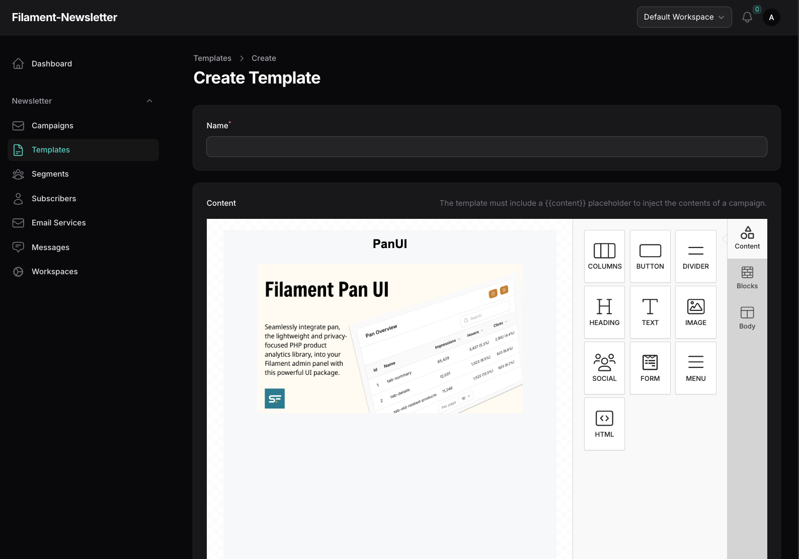

# Choosing an Editor

We currently support the default Filament RichEditor, [Filament Unlayer](https://github.com/solutionforest/filament-unlayer), and [Filament Tiptap Editor](https://github.com/awcodes/filament-tiptap-editor). Data from Filament Unlayer or Filament Tiptap Editor fields are stored as JSON in a separate field, while the HTML output is stored.

To configure the editor, update the setting in the configuration file:

```bash
'email-content-editor' => 'unlayer',
```

## Rich Editor

The default editor is the original [Filament RichEditor](https://filamentphp.com/docs/3.x/forms/fields/rich-editor). Please refer to its documentation to learn more.

## Filament Unlayer

We support [Filament Unlayer](https://github.com/solutionforest/filament-unlayer). Please refer to its documentation to learn more.

### Installation

To install the package, use Composer:

```bash
composer require solution-forest/filament-unlayer
php artisan filament:assets
```



## Tiptap Editor

We support [Filament Tiptap Editor](https://github.com/awcodes/filament-tiptap-editor). Please refer to its documentation to learn more.

### Installation

To install the package, use Composer:

```bash
composer require awcodes/filament-tiptap-editor:"^3.0"
```

To align with Filament's theming methodology, a custom theme is required to use this plugin.

> **Note:** If you haven't set up a custom theme and are using a Panel, refer to the Filament Docs first. The following instructions apply to both the Panels Package and the standalone Forms package.

Import the plugin's stylesheet and tippy.js stylesheet (if not already included) into your theme's CSS file:

```css
@import '<path-to-vendor>/awcodes/filament-tiptap-editor/resources/css/plugin.css';
```

Add the plugin's views to your `tailwind.config.js` file:

```javascript
content: [
    ...
    '<path-to-vendor>/awcodes/filament-tiptap-editor/resources/**/*.blade.php',
]
```

Include the `tailwindcss/nesting` plugin in your `postcss.config.js` file:

```javascript
module.exports = {
    plugins: {
        'tailwindcss/nesting': {},
        tailwindcss: {},
        autoprefixer: {},
    },
}
```

Finally, rebuild your custom theme:

```bash
npm run build
```
