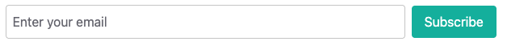
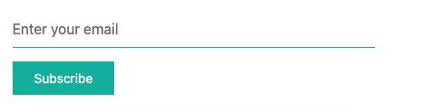
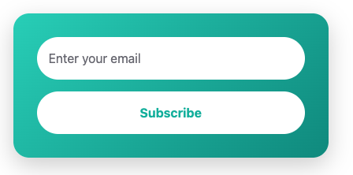
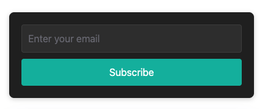
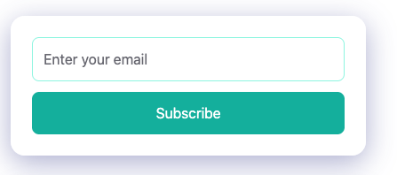
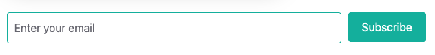

# Filaletter Livewire Form Usage Guide

This guide shows you how to easily embed Filaletter subscription forms anywhere on your website using Livewire components.

## Minimum Requirement
**version 3.1.0**

## Overview

The Filaletter Livewire Form component allows you to:
- **Embed subscription forms** anywhere on your Laravel application
- **Choose from 6 built-in themes** or create custom views
- **Handle subscriptions server-side** with proper validation and error handling
- **Integrate with SendPortal API** for newsletter management
- **Customize appearance** through themes or custom Blade templates

## Quick Start

### Basic Usage

```blade
<!-- Minimal setup - uses default theme -->
<livewire:newsletter-subscribe-form  
    sendportal_api_token="$your_api_token"
    workspace_id="1"
/>
```

### Complete Example with All Parameters

```blade
<livewire:newsletter-subscribe-form  
    sendportal_api_token="$your_api_token"
    workspace_id="1"
    tag_id="3"
    url="https://api.yourdomain.com/newsletter/subscribe"
    theme="glass"
    view="custom.newsletter-form"
/>
```

## Configuration

### Global Configuration

Configure defaults in your `config/filament-newsletter.php`:

```php
'newsletter-form' => [
    'view' => 'filament-newsletter::livewire.subscription.newsletter-form',
    'theme' => 'default', // Global default theme
    'themes' => [
        'default' => 'filament-newsletter::livewire.subscription.themes.default',
        'minimal' => 'filament-newsletter::livewire.subscription.themes.minimal',
        'rounded' => 'filament-newsletter::livewire.subscription.themes.rounded',
        'dark' => 'filament-newsletter::livewire.subscription.themes.dark',
        'glass' => 'filament-newsletter::livewire.subscription.themes.glass',
        'inline' => 'filament-newsletter::livewire.subscription.themes.inline',
    ],
],
```

## Built-in Themes

### 1. Default Theme
Clean, horizontal layout with flexbox design:



```blade
<livewire:newsletter-subscribe-form  theme="default" :sendportal_api_token="$token" />
```

### 2. Minimal Theme
Minimal design with bottom-border input:



```blade
<livewire:newsletter-subscribe-form  theme="minimal" :sendportal_api_token="$token" />
```

### 3. Rounded Theme
Gradient background with fully rounded elements:



```blade
<livewire:newsletter-subscribe-form  theme="rounded" :sendportal_api_token="$token" />
```

### 4. Dark Theme
Dark mode design with dark backgrounds:



```blade
<livewire:newsletter-subscribe-form  theme="dark" :sendportal_api_token="$token" />
```

### 5. Glass Theme
Modern glassmorphism effect with backdrop blur:



```blade
<livewire:newsletter-subscribe-form  theme="glass" :sendportal_api_token="$token" />
```

### 6. Inline Theme
Responsive horizontal layout that wraps on smaller screens:



```blade
<livewire:newsletter-subscribe-form  theme="inline" :sendportal_api_token="$token" />
```

## Component Properties

| Property | Type | Required | Description |
|----------|------|----------|-------------|
| `sendportal_api_token` | String | Yes | Your SendPortal API token (see [Api authentication](../3-api/2-authentication) to learn more.) |
| `workspace_id` | Integer | No | Workspace ID (defaults to current workspace) |
| `tag_id` | Integer | No | Tag ID to assign to subscribers |
| `url` | String | No | Custom API endpoint URL (defaults to `route('sendportal.api.subscribers.store')`) |
| `theme` | String | No | Theme name (overrides global config) |
| `view` | String | No | Custom view path (overrides theme) |


## Custom Views

### Creating Custom Theme

1. Create your custom view file:
```blade
<!-- resources/views/newsletter/custom-theme.blade.php -->
<div class="my-custom-form">
    <form wire:submit="submit">
        <input type="email" 
               placeholder="Enter your email" 
               wire:model="data.email" 
               class="my-input-class">
        
        <button type="submit" class="my-button-class">
            Subscribe
        </button>
        
        @error('data.email') 
            <div class="error">{{ $message }}</div> 
        @enderror
        
        @error('subscribe-error') 
            <div class="error">{{ $message }}</div> 
        @enderror
        
        @if (session()->has('success-message'))
            <div class="success">{{ session('success-message') }}</div>
        @endif
    </form>
</div>
```

2. Register in config:
```php
'newsletter-form' => [
    'themes' => [
        'default' => 'filament-newsletter::livewire.subscription.themes.default',
        'custom' => 'newsletter.custom-theme', // Your custom theme
    ],
],
```

3. Use your custom theme:
```blade
<livewire:newsletter-subscribe-form  
    :sendportal_api_token="'your-token'"
    theme="custom"
/>
```

### Direct Custom View

```blade
<!-- Skip theme system and use view directly -->
<livewire:newsletter-subscribe-form  
    :sendportal_api_token="'your-token'"
    view="newsletter.my-custom-form"
/>
```

## View Resolution Priority

The component uses a **priority-based system** for determining which view to render:

1. **Component-level `view` property** (highest priority)
   ```blade
   <livewire:newsletter-subscribe-form  view="custom.my-form" />
   ```

2. **Component-level `theme` property**
   ```blade
   <livewire:newsletter-subscribe-form  theme="minimal" />
   ```

3. **Global config `theme` setting**
   ```php
   // config/filament-newsletter.php
   'newsletter-form' => ['theme' => 'dark']
   ```

4. **Global config `view` setting**
   ```php
   // config/filament-newsletter.php
   'newsletter-form' => ['view' => 'custom.global-form']
   ```

5. **Package default view** (fallback)
   ```
   filament-newsletter::livewire.subscription.newsletter-form
   ```

This means you can override views at any level, with component-level properties taking precedence over global configuration.
