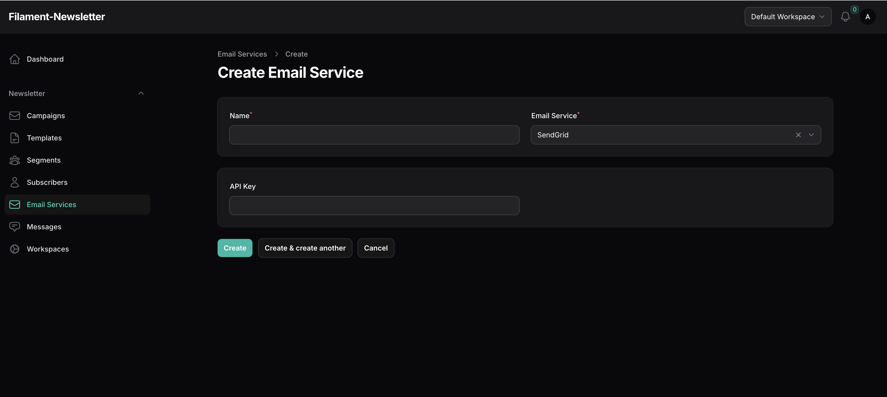

# SendGrid

## Sending Emails

To send emails using the Twilio SendGrid provider, you will need a SendGrid account. If you don't already have one, visit the [SendGrid website](https://sendgrid.com) and sign up. No credit card is required, and you can get up to 100 free emails per month.

Once registered, open the Setup Guide, choose the Web API integration, and select the PHP language option.

Generate an API key and copy it to your SendPortal configuration.

Check the "I've integrated the code above" box and click Next.

Send a test email from SendPortal, and if it works successfully, click Verify integration.

## Tracking

Open and click tracking is enabled by default in SendGrid, but if you'd like to check the settings, you'll find them under **Settings > Tracking**.

You can also enable subscription tracking from this page. If enabled, SendGrid will automatically add unsubscribe links to the bottom of every email you send.

To enable tracking within Filaletter, you'll need to enable event notifications from **Settings > Mail Settings**.

The HTTP POST URL depends on your domain but must end with `/api/v1/webhooks/sendgrid`. For example, if Filaletter is installed at `https://campaigns.marketing.com`, then each webhook should point to `https://campaigns.marketing.com/api/v1/webhooks/sendgrid`.

That's it! You're now set up to send and track emails using SendGrid.