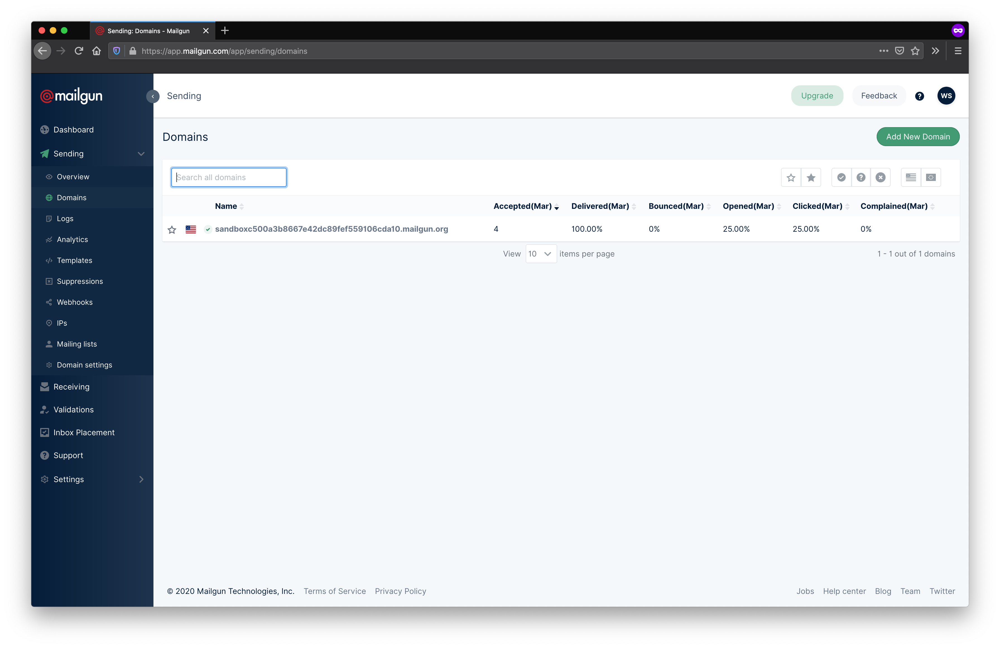
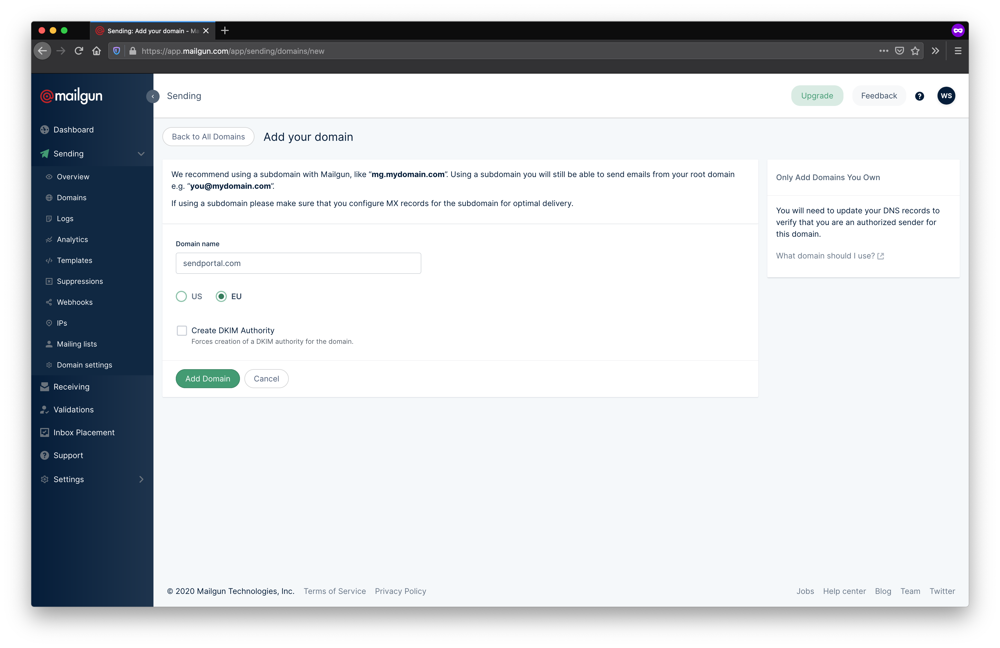
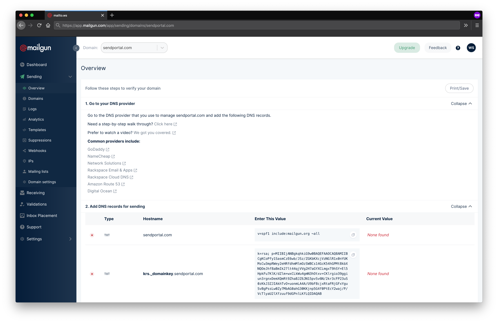
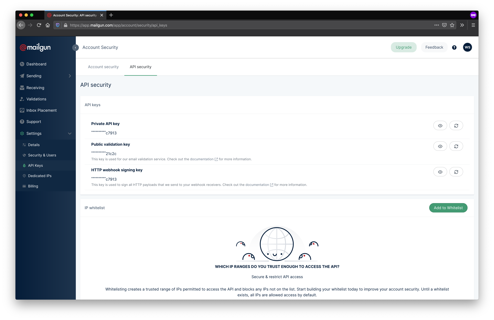
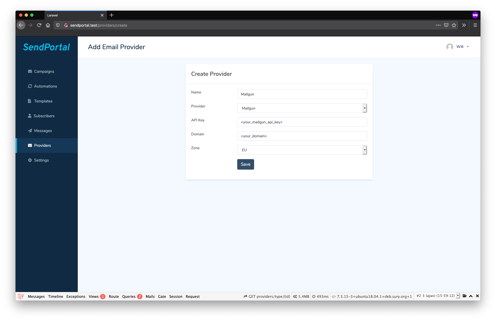
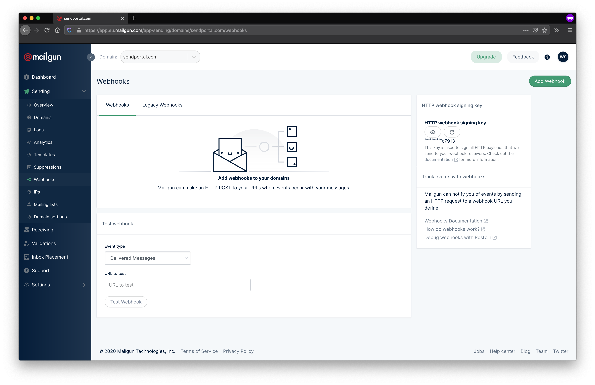
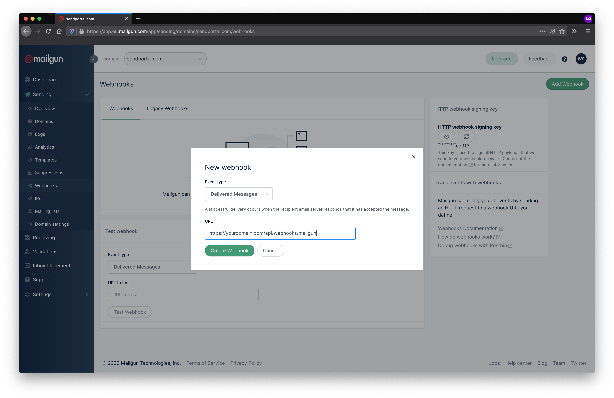
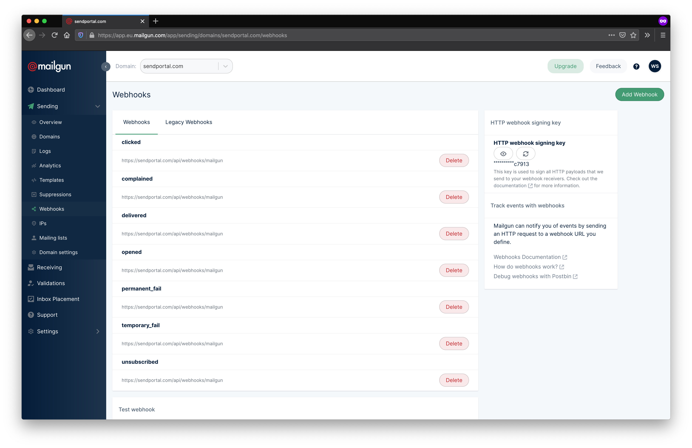

# Mailgun

## Sending Emails

When you first begin, Mailgun will automatically create a sandbox domain that you can use for sending. To send using your own domain, you'll need to create a custom domain. Select **Sending** then **Domains** from the menu on the left-hand side, then click **Add New Domain** (you'll need to add credit card details before this button appears).

Enter the domain name, choose whichever region makes the most sense for you, and click **Add Domain**.

You'll now need to visit the site that you use to manage DNS for the domain provided (usually the domain registrar). The steps to do this are beyond the scope of this documentation as they vary from provider to provider, but you will need to create a TXT entry for the relevant domain and paste in the strings from the **Hostname** and **Enter This Value** columns. Once you've added these, click **Verify DNS Settings**.

You'll now need to copy the Private API Key from **Settings > API Keys**.

Then paste this into your SendPortal provider configuration.

## Tracking

To enable tracking, select **Sending** then **Webhooks** from the menu and click the **Add Webhook** button.

The URL depends on your domain but must end with `/api/v1/webhooks/mailgun`. For example, if Filaletter is installed at `https://campaigns.marketing.com`, then each webhook should point to `https://campaigns.marketing.com/api/v1/webhooks/mailgun`.

You'll need to add an entry for each type of event you want to track, but the URL is the same for each of them.

That's it! You're now set up to send and track emails using Mailgun.