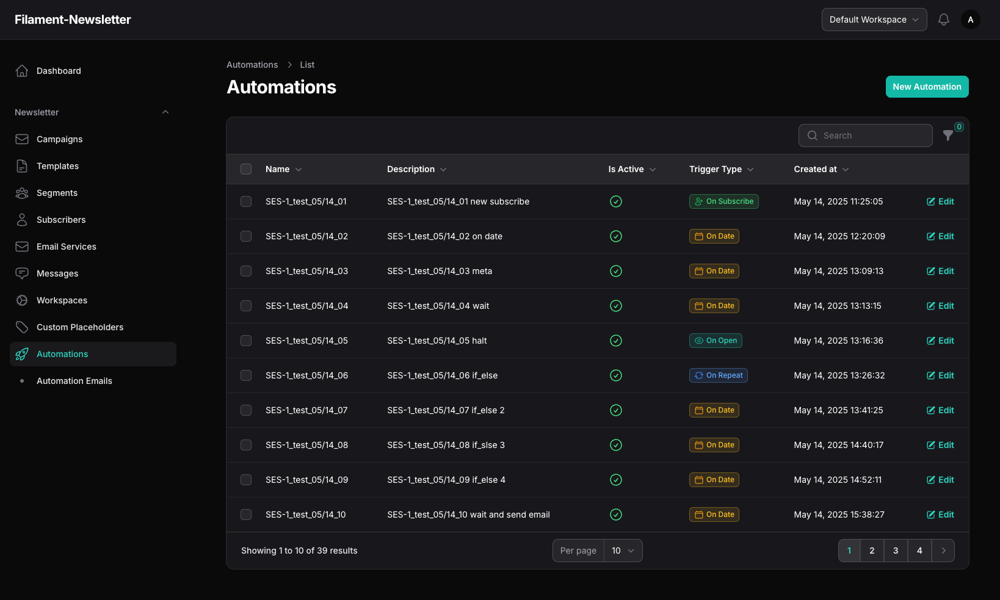
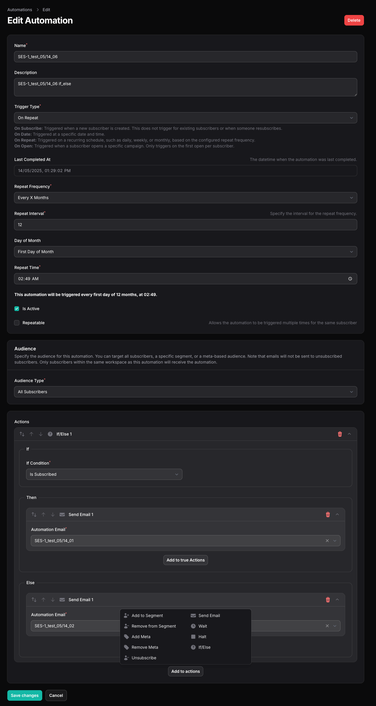

# Automation Function Overview

The Automation feature in this package allows you to create powerful, flexible workflows that automatically send emails or perform actions based on specific triggers and conditions. This helps you engage your audience efficiently and consistently, without manual intervention.

## Key Features

- **Multiple Trigger Types:**  
  Automations can be triggered by various events, such as a subscriber joining a list, opening a campaign, or on specific dates and repeat schedules.

- **Flexible Scheduling:**  
  Set up automations to run on a one-time basis, or repeat daily, weekly, monthly, or at custom intervals.

- **Audience Targeting:**  
  Choose to send automations to all subscribers, specific segments, or based on custom metadata.

- **Custom Actions:**  
  Build automation flows using a visual builder, allowing you to add, reorder, and configure actions like sending emails, updating subscriber data, and more.

- **Status & Activity:**  
  Easily activate or deactivate automations, and view when each automation last ran.

## Example Use Cases

- **Welcome Series:**  
  Automatically send a sequence of emails to new subscribers.

- **Re-engagement:**  
  Target subscribers who haven’t opened recent campaigns.

- **Event Reminders:**  
  Send reminders before or after specific dates.

## How to Create an Automation

1. **Go to Automations:**  
   Navigate to the Automations section in your dashboard.

2. **Create New Automation:**  
   Click "Create" and fill in the automation name and description.

3. **Set Trigger:**  
   Choose how and when the automation should start (e.g., on subscribe, on open, on a date, or on a repeating schedule).

4. **Define Audience:**  
   Select who should receive the automation (all, segment, or meta-based).

5. **Build Actions:**  
   Use the builder to add and configure the steps your automation should perform.

6. **Activate:**  
   Enable the automation to start running according to your settings.

## Tips

- Use the preview and description fields to understand how your repeat schedules will work.
- Combine audience filters and triggers for highly targeted campaigns.
- You can edit or deactivate automations at any time.
