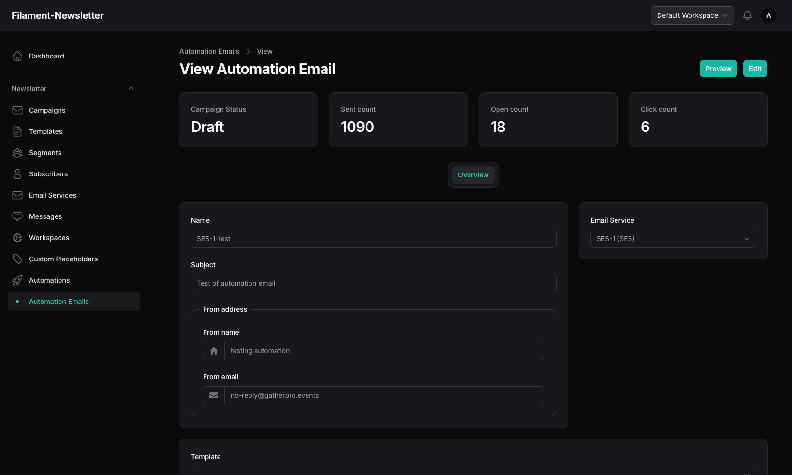

# Automation Emails

Automation Emails are a core part of the automation workflow in this package. They allow you to create, manage, and send targeted email messages as part of your automated campaigns.

## What Are Automation Emails?

Automation Emails are email messages that are sent automatically to your subscribers based on the triggers and conditions you define in your automations. They are stored in the same database table as campaigns.

## Typical Use Cases

- Welcome emails for new subscribers
- Drip campaigns and onboarding sequences
- Follow-up or reminder emails
- Re-engagement messages for inactive users
